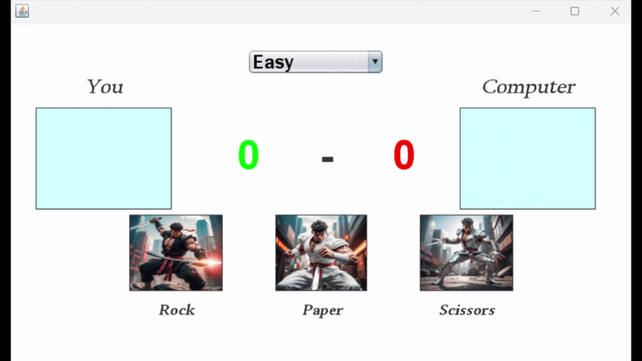

# Rock Paper Scissors
This is a Java Swing desktop game where you get to pick the difficulty level from **Easy**(random), **Medium**(60% smart), or **Hard**(full AI prediction)
Then play again the computer picking either **Rock**, **Paper** or **Scissors**, you play three rounds and whoever wins more wins the match, 
You can click **Play Again** to reset and go again.

# How the AI Works

The computer's strategy changes based on the difficulty you select:

> **Easy** — Picks Rock, Paper, or Scissors completely at random, no strategy.
> **Medium** — 60% of the time uses the Hard AI prediction; 40% of the time picks randomly, which keeps it feeling fair and unpredictable.
> **Hard** — Tracks every move you've made in the match. Counts how many times you picked Rock, Paper, and Scissors, then picks the move that wins against your most-used one.
> **e.g** If you've picked Rock 3 times, Paper 1 time, and Scissors 0 times, the AI picks **Paper** to counter your Rock habit.

# Running the Game
1. Open NetBeans IDE
2. File → Open Project → select the games folder
3. Press the green **Run** button

